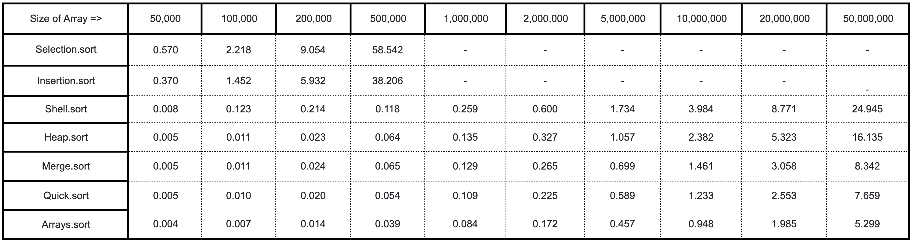

# Sorting Techniques

This repository contains a list of different types of sorting techniques:

- [Selection Sort](./src/sort/Selection.java)
- [Insertion Sort](./src/sort/Insertion.java)
- [Shell Sort](./src/sort/Shell.java)
- [Heap Sort](./src/sort/Heap.java)
- [Merge Sort](./src/sort/Merge.java)
- [Quick Sort](./src/sort/Quick.java)

On the other hand, I have compared all the types of sorting techniques.
The type of comparison that we can see here is:
 1. Testing all the types of a sort on a random array.
 2. Testing all the types of sorting on N randomly generated array and taking out average.

To compare and to calculate the time taken by them we need some more small classes which are:

- [Timer](./src/Timer.java) (To capture time taken to perform any task in nanoseconds)
- [Shuffle](./src/Shuffle.java) (To generate a random array for a given length)
- [Stats](./src/Stats.java) (To store all times and calculate an average value from it)
- [CompareSorts](./src/CompareSorts.java) (To compare between different sorting techniques on a random array)
- [Test](./src/Test.java) (To run a single/multiple sorts on N random arrays of a given size and keep their average)
- [Sort](./src/sort/Sort.java) (An interface that works as the parent for all the sort types)
- [ArraySort](./src/sort/ArraySort.java) (A class that used to duplicate Java's array sort as a child of Sort)
- [Order](./src/sort/Order.java) (An enum to decide in which order we want to sort the array)

PS: Another interesting comparison between sort methods where the sort methods are compared based on the sort method
which took maximum time. [check here](./Comparison.md) 